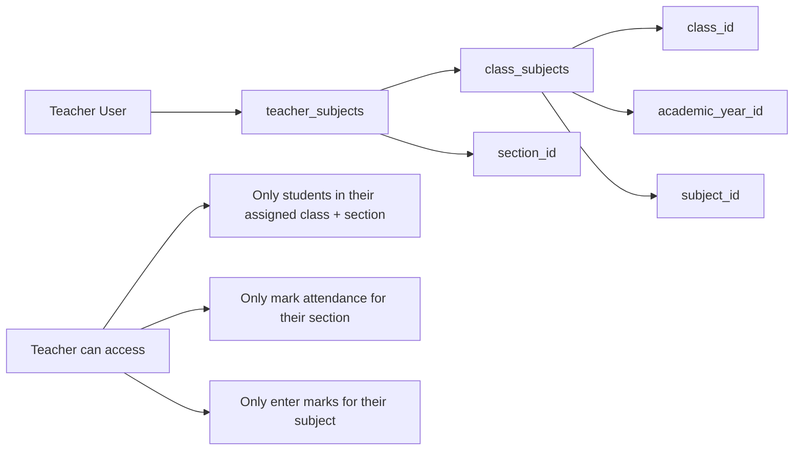
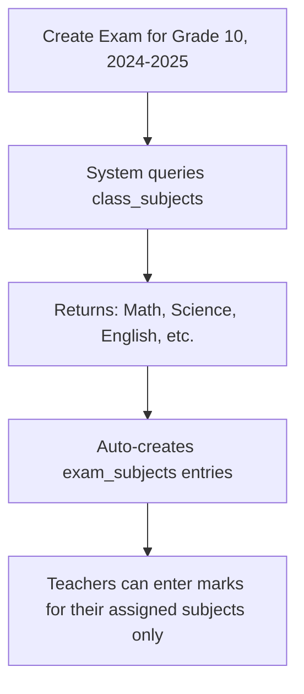
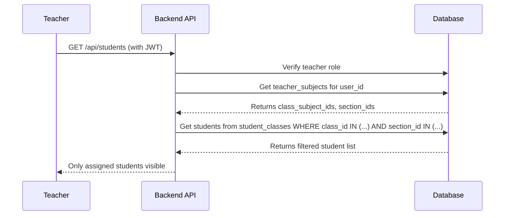

# STEP 1 — Database Design for K-12 School Management System

## Overview

This document presents the complete Entity-Relationship (ER) design for a K-12 School Management System. The design supports:
- Multi-school readiness (future expansion)
- Role-Based Access Control (RBAC)
- Dynamic subjects per class per academic year
- Fine-grained teacher assignments
- Complete academic lifecycle management

---

## ER Diagram

```mermaid
erDiagram
    %% Core User & RBAC
    schools ||--o{ users : "has"
    users ||--o{ user_roles : "has"
    roles ||--o{ user_roles : "assigned_to"
    roles ||--o{ role_permissions : "has"
    permissions ||--o{ role_permissions : "granted_to"
    
    %% Academic Structure
    schools ||--o{ academic_years : "has"
    schools ||--o{ classes : "has"
    schools ||--o{ sections : "has"
    schools ||--o{ subjects : "has"
    
    %% Dynamic Subjects (KEY RELATIONSHIP)
    classes ||--o{ class_subjects : "has"
    academic_years ||--o{ class_subjects : "scoped_by"
    subjects ||--o{ class_subjects : "included_in"
    
    %% Teacher Assignment
    users ||--o{ teacher_subjects : "teaches"
    class_subjects ||--o{ teacher_subjects : "assigned_to"
    sections ||--o{ teacher_subjects : "for_section"
    
    %% Students & Parents
    users ||--o{ students : "profile"
    students ||--o{ student_classes : "enrolled_in"
    classes ||--o{ student_classes : "contains"
    sections ||--o{ student_classes : "in_section"
    academic_years ||--o{ student_classes : "during"
    
    users ||--o{ parents : "profile"
    students ||--o{ student_parents : "has"
    parents ||--o{ student_parents : "guardian_of"
    
    %% Attendance
    students ||--o{ attendance : "has"
    student_classes ||--o{ attendance : "for"
    
    %% Exams & Results
    academic_years ||--o{ exams : "has"
    schools ||--o{ exams : "conducts"
    exams ||--o{ exam_subjects : "includes"
    class_subjects ||--o{ exam_subjects : "linked_to"
    
    exam_subjects ||--o{ exam_results : "has"
    students ||--o{ exam_results : "achieves"
    users ||--o{ exam_results : "entered_by"
    
    students ||--o{ report_cards : "receives"
    exams ||--o{ report_cards : "for"
    
    %% LMS / Assignments
    teacher_subjects ||--o{ assignments : "creates"
    assignments ||--o{ assignment_files : "has"
    assignments ||--o{ submissions : "receives"
    students ||--o{ submissions : "submits"
    submissions ||--o{ submission_files : "has"
    
    %% Notices
    schools ||--o{ notices : "posts"
    users ||--o{ notices : "created_by"
    
    %% Promotions
    students ||--o{ promotions : "has"
    academic_years ||--o{ promotions : "from_year"
    academic_years ||--o{ promotions : "to_year"

    %% Entity Definitions
    schools {
        int id PK
        varchar name
        varchar code UK
        varchar address
        varchar phone
        varchar email
        varchar logo_url
        boolean is_active
        datetime created_at
        datetime updated_at
    }

    users {
        int id PK
        int school_id FK
        varchar email UK
        varchar password_hash
        varchar first_name
        varchar last_name
        varchar phone
        varchar avatar_url
        enum status "active,inactive,suspended"
        datetime last_login
        datetime created_at
        datetime updated_at
    }

    roles {
        int id PK
        varchar name UK
        varchar description
        datetime created_at
    }

    permissions {
        int id PK
        varchar name UK
        varchar module
        varchar description
        datetime created_at
    }

    user_roles {
        int id PK
        int user_id FK
        int role_id FK
        datetime created_at
    }

    role_permissions {
        int id PK
        int role_id FK
        int permission_id FK
        datetime created_at
    }

    academic_years {
        int id PK
        int school_id FK
        varchar name
        date start_date
        date end_date
        boolean is_current
        datetime created_at
        datetime updated_at
    }

    classes {
        int id PK
        int school_id FK
        varchar name
        int grade_level
        int display_order
        datetime created_at
    }

    sections {
        int id PK
        int school_id FK
        varchar name
        int capacity
        datetime created_at
    }

    subjects {
        int id PK
        int school_id FK
        varchar name
        varchar code UK
        varchar description
        boolean is_optional
        datetime created_at
    }

    class_subjects {
        int id PK
        int class_id FK
        int academic_year_id FK
        int subject_id FK
        int full_marks
        int pass_marks
        int credit_hours
        datetime created_at
    }

    teacher_subjects {
        int id PK
        int user_id FK
        int class_subject_id FK
        int section_id FK
        boolean is_class_teacher
        datetime created_at
    }

    students {
        int id PK
        int user_id FK
        varchar admission_number UK
        date date_of_birth
        enum gender "male,female,other"
        varchar blood_group
        text address
        varchar emergency_contact
        date admission_date
        datetime created_at
        datetime updated_at
    }

    student_classes {
        int id PK
        int student_id FK
        int class_id FK
        int section_id FK
        int academic_year_id FK
        int roll_number
        enum status "active,transferred,graduated,dropped"
        datetime created_at
    }

    parents {
        int id PK
        int user_id FK
        varchar occupation
        varchar workplace
        text address
        datetime created_at
        datetime updated_at
    }

    student_parents {
        int id PK
        int student_id FK
        int parent_id FK
        enum relationship "father,mother,guardian"
        boolean is_primary
        datetime created_at
    }

    attendance {
        int id PK
        int student_class_id FK
        int student_id FK
        date attendance_date
        enum status "present,absent,late,excused"
        text remarks
        int marked_by FK
        datetime created_at
        datetime updated_at
    }

    exams {
        int id PK
        int school_id FK
        int academic_year_id FK
        varchar name
        enum exam_type "unit_test,midterm,final,board"
        date start_date
        date end_date
        boolean is_published
        datetime created_at
        datetime updated_at
    }

    exam_subjects {
        int id PK
        int exam_id FK
        int class_subject_id FK
        date exam_date
        time start_time
        time end_time
        int full_marks
        int pass_marks
        datetime created_at
    }

    exam_results {
        int id PK
        int exam_subject_id FK
        int student_id FK
        decimal marks_obtained
        decimal practical_marks
        enum grade "A+,A,B+,B,C+,C,D,E,F"
        text remarks
        int entered_by FK
        datetime created_at
        datetime updated_at
    }

    report_cards {
        int id PK
        int student_id FK
        int exam_id FK
        int student_class_id FK
        decimal total_marks
        decimal percentage
        varchar overall_grade
        int rank
        text teacher_remarks
        text principal_remarks
        boolean is_published
        datetime generated_at
        datetime created_at
    }

    assignments {
        int id PK
        int teacher_subject_id FK
        varchar title
        text description
        date due_date
        int total_marks
        boolean is_published
        datetime created_at
        datetime updated_at
    }

    assignment_files {
        int id PK
        int assignment_id FK
        varchar file_name
        varchar file_url
        varchar file_type
        int file_size
        datetime created_at
    }

    submissions {
        int id PK
        int assignment_id FK
        int student_id FK
        text content
        enum status "submitted,late,graded,returned"
        decimal marks_obtained
        text feedback
        int graded_by FK
        datetime submitted_at
        datetime graded_at
        datetime created_at
    }

    submission_files {
        int id PK
        int submission_id FK
        varchar file_name
        varchar file_url
        varchar file_type
        int file_size
        datetime created_at
    }

    notices {
        int id PK
        int school_id FK
        int created_by FK
        varchar title
        text content
        enum target_audience "all,students,parents,teachers"
        enum priority "low,normal,high,urgent"
        boolean is_published
        date publish_date
        date expiry_date
        datetime created_at
        datetime updated_at
    }

    promotions {
        int id PK
        int student_id FK
        int from_class_id FK
        int from_academic_year_id FK
        int to_class_id FK
        int to_academic_year_id FK
        enum status "promoted,detained,graduated"
        text remarks
        int processed_by FK
        datetime processed_at
        datetime created_at
    }
```



---

## Table Descriptions & Relationships

### 1. Core User & RBAC System

| Table | Description |
|-------|-------------|
| **schools** | Master table for school(s). Supports multi-school architecture. |
| **users** | All system users (admins, teachers, students, parents). Linked to school. |
| **roles** | System roles: SUPER_ADMIN, ADMIN, TEACHER, STUDENT, PARENT |
| **permissions** | Granular permissions: `student.create`, `attendance.mark`, etc. |
| **user_roles** | Many-to-many: Users can have multiple roles |
| **role_permissions** | Many-to-many: Roles have multiple permissions |

### 2. Academic Structure

| Table | Description |
|-------|-------------|
| **academic_years** | Academic year periods (e.g., 2024-2025). One marked as `is_current`. |
| **classes** | Grade levels 1-12. School-specific. |
| **sections** | Class divisions (A, B, C). Reusable across classes. |
| **subjects** | Master subject list per school (Math, Science, etc.) |

### 3. Dynamic Subjects Model (KEY CONCEPT)

| Table | Description |
|-------|-------------|
| **class_subjects** | **The bridge table that defines which subjects are taught in which class, for which academic year.** |

> [!IMPORTANT]
> **Dynamic Subjects Rule:**
> Subjects are NOT fixed per class. They are defined **per class, per academic year** via `class_subjects`.
> 
> Example: Grade 10 might have "Computer Science" in 2024-2025 but not in 2023-2024.

**class_subjects** structure:
```
class_subjects (
  class_id,        → Which class
  academic_year_id, → Which year
  subject_id,      → Which subject
  full_marks,      → Max marks for this subject
  pass_marks,      → Passing marks
  credit_hours     → Credit weight
)
```

### 4. Teacher Assignment Model (KEY CONCEPT)

| Table | Description |
|-------|-------------|
| **teacher_subjects** | Assigns teachers to specific class-subject combinations for a section |

> [!IMPORTANT]
> **Teacher Assignment Rule:**
> Teachers are assigned to teach a **specific subject** in a **specific class** for a **specific section**.
> 
> This is achieved by linking to `class_subjects` (which already contains class + academic_year + subject).

**teacher_subjects** structure:
```
teacher_subjects (
  user_id,          → Teacher user ID
  class_subject_id, → References class_subjects (class + year + subject)
  section_id,       → Which section
  is_class_teacher  → Whether they're the class teacher
)
```

**How Teacher Access Works:**



### 5. Student Management

| Table | Description |
|-------|-------------|
| **students** | Extended profile linked to `users`. Contains admission info. |
| **student_classes** | **Enrollment history**: Which class/section a student is in for each academic year. |
| **parents** | Extended profile for parent users. |
| **student_parents** | Links students to their parents (one-to-many). |

### 6. Attendance System

| Table | Description |
|-------|-------------|
| **attendance** | Daily attendance records per student per day |

**Access Control:**
- Teachers can only mark attendance for their assigned section
- Verified via `teacher_subjects` → `section_id`

### 7. Exams & Results

| Table | Description |
|-------|-------------|
| **exams** | Exam definitions (midterm, final, etc.) per academic year |
| **exam_subjects** | Links exams to `class_subjects` - auto-pulls subjects from class configuration |
| **exam_results** | Individual student marks per exam subject |
| **report_cards** | Aggregated results: totals, percentages, grades, ranks |

**Exam Subject Auto-Linking:**


### 8. LMS / Assignments

| Table | Description |
|-------|-------------|
| **assignments** | Created by teachers, linked to their `teacher_subjects` |
| **assignment_files** | Attached files (PDF, images) |
| **submissions** | Student submissions with status tracking |
| **submission_files** | Files submitted by students |

### 9. Notices & Promotions

| Table | Description |
|-------|-------------|
| **notices** | Announcements with target audience filtering |
| **promotions** | End-of-year promotion records with history preservation |

---

## Key Design Principles

### 1. Academic Year Scoping

> [!WARNING]
> **Every academic data MUST be scoped by academic year!**

All these tables are scoped:
- `class_subjects` → `academic_year_id`
- `teacher_subjects` → via `class_subjects.academic_year_id`
- `student_classes` → `academic_year_id`
- `exams` → `academic_year_id`
- `attendance` → via `student_classes.academic_year_id`

### 2. Soft Delete Strategy

Instead of hard deleting records:
- Use `status` fields (active/inactive/suspended)
- Preserve historical data integrity
- Support audit trails

### 3. Index Strategy

Indexes recommended on:
- `users.school_id, users.email`
- `class_subjects.class_id, class_subjects.academic_year_id`
- `teacher_subjects.user_id, teacher_subjects.class_subject_id`
- `student_classes.student_id, student_classes.academic_year_id`
- `attendance.student_id, attendance.attendance_date`
- `exam_results.student_id, exam_results.exam_subject_id`

### 4. Multi-School Ready

The `schools` table and `school_id` foreign keys enable future multi-school expansion without schema changes.

---

## Sample Data Flow: Teacher Sees Only Their Data



---

## STEP 1 COMPLETE

> [!NOTE]
> **Ready for Review**
> 
> This ER design covers:
> - ✅ 20+ normalized tables
> - ✅ Dynamic subjects per class per academic year
> - ✅ Fine-grained teacher assignments
> - ✅ Complete RBAC structure
> - ✅ Multi-school ready architecture
> - ✅ Proper foreign key relationships

---

## User Review Required

Please confirm to proceed to **STEP 2 — SQL Schema** where I will generate complete MySQL CREATE TABLE scripts with all constraints, foreign keys, and indexes.
